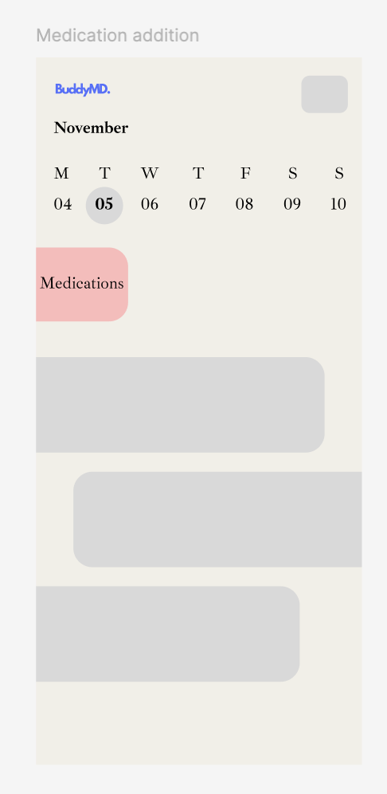

# Project Title

Buddy MD

## Overview

Buddy MD is a user-friendly medication tracker designed to help individuals with chronic conditions manage their medication schedules effectively.

### Problem Space

Managing chronic diseases requires strict adherence to medication schedules, yet many patients struggle with:

- Forgetting to take medication on time

- Running out of prescriptions

- Lack of insights into their adherence trends

- Difficulty communicating their medication history to healthcare providers

### User Profile

Patients: Need structured medication reminders and tracking

### Features

As a user, I want to receive medication reminders via push notifications or SMS

As a user, I want to log my medication intake to track adherence

As a user, I want to see my medication history and trends in a dashboard

As a user, I want to get alerts when my prescription is running low

As a user, I want to view drug information and interactions

## Implementation

### Tech Stack

- React
- MySQL
- Express
- Client libraries:
  - react
  - react-router
  - axios
- Server libraries:
  - knex
  - express
  - bcrypt for password hashing

### APIs

- Drug Interaction API: Check for medication interactions
- Health Data API: Apple Health

### Sitemap

- Welcome Page – User introduction and onboarding

- Sign-Up / Login – User authentication

- Dashboard – Medication schedule overview and adherence stats

- Medication Management – Add, edit, and track medications

- Reports & Analytics – View medication trends and adherence reports

### Mockups

- Welcome Page
  

- Login Page
  

- Dashboard
  

- Medication Tracking View
  

- Reports & Insights Page
  

### Data

Users (ID, Name, Email, Password, Preferences)

Medications (Name, Dosage, Frequency, Start/End Date, Side Effects, Notes)

Adherence Logs (Timestamp, Taken/Missed Status)

Reminders (Time, Delivery Method, Status)

### Endpoints

GET /medications – Fetch a user’s medication list

POST /medications – Add a new medication

PUT /medications/:id – Update medication details

DELETE /medications/:id – Remove a medication

POST /reminders – Create a medication reminder

GET /reports – Fetch medication adherence trend

## Roadmap

- Sprint 1: Setup & Authentication

Initialize React project and Express server

Develop UI wireframes in Figma

- Sprint 2: Core Features

Implement medication management (CRUDE)

Build reminder notifications with Twilio API

Integrate OpenFDA/RxNorm API for drug information

- Sprint 3: Enhancements & Reports

Develop adherence analytics and reports

- Sprint 4: Finalization & Deployment

Perform bug fixes and security improvements

- Deploy

---

## Future Implementations

- Implement Firebase authentication

- Recipes tailored to side effects – Suggest meals based on medications and their side effects to minimize discomfort and enhance nutrition.

- Daily healthy tips – Provide users with wellness tips tailored to their health conditions and medication regimen.
